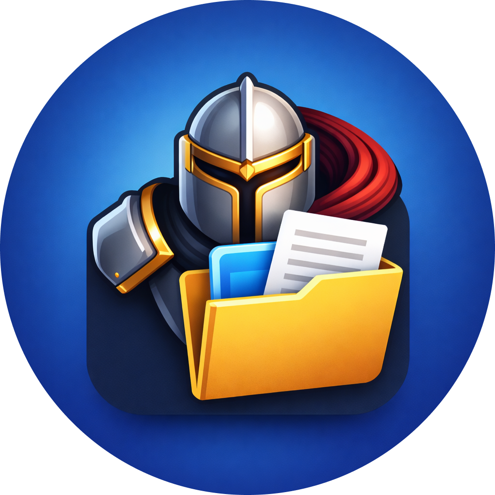

# FileKnight

**A simple cross-platform tool that protects your files from being lost.**

Automates copying folders or files from one location to another, acting as a reliable checkpoint against forgetfulness.

*Instructions on `info.txt`*
